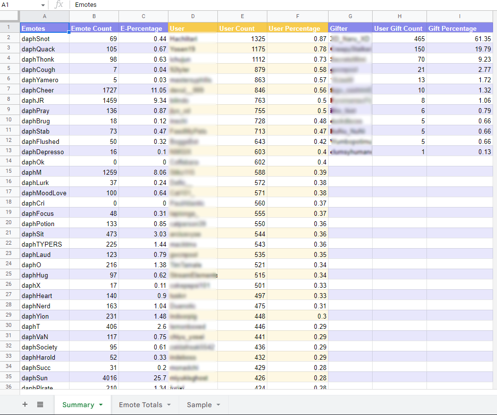
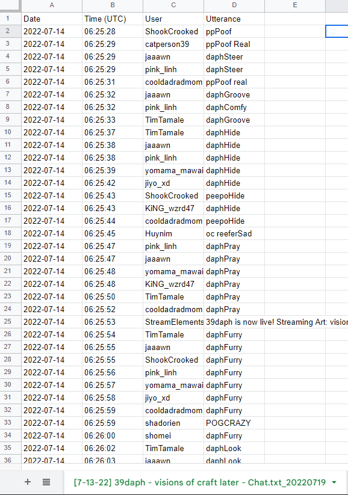

# Purpose 
Twitch Report is built for those who are looking to analyse their favourite streamers' emote usage or gifted sub count.

Twitch Text to CSV is built to organise Twitch Chat data into a format that can be more easily parsed and saved. 

## Twitch Report Creation
See option 1 "https://www.datasourse.com/check-or-download-twitch-chat-log-history/" to find out how to download Twitch channels' chat logs. 

The "example_" folders contain files that illustrate what your files should look like or what files are generated. 

# Usage
### Script 1: Twitch Text to CSV  
 **Run through command prompt/terminal**   
  
This script generates a folder of CSV files -- converting txt files to csv  
  
**Windows Input:**   
py -3 twitchReport.py (Input folder) (Generated Folder Name) --savepath (Save Path)   

**Mac Input:** 
python3 twitchReport.py (Input folder) (Generated Folder Name) --savepath (Save Path)

### Script 2: Twitch Config Setup  
**Run through command prompt/terminal**   
  
This script generates a config.yaml containing a list of streamers with emotes  
  
**Windows Input:** 
py -3 twitchReport.py (Input text file) --savepath (Save Path)   

**Mac Input:** 
python3 twitchReport.py (Input text file) --savepath (Save Path)

### Script 3: Twitch Report  
**Run through command prompt/terminal**   

This script generates a new file containing an analysis from Twitch Chat CSVs  
  
**Windows Input:** 
py twitchReport.py (Streamer Title) (Input folder) (Generated File Name) (Config Path) (Excel Template Path) --savepath (Save Path)   

**Mac Input:** 
python3 twitchReport.py (Streamer Title) (Input folder) (Generated File Name) (Config Path) (Excel Template Path) --savepath (Save Path)