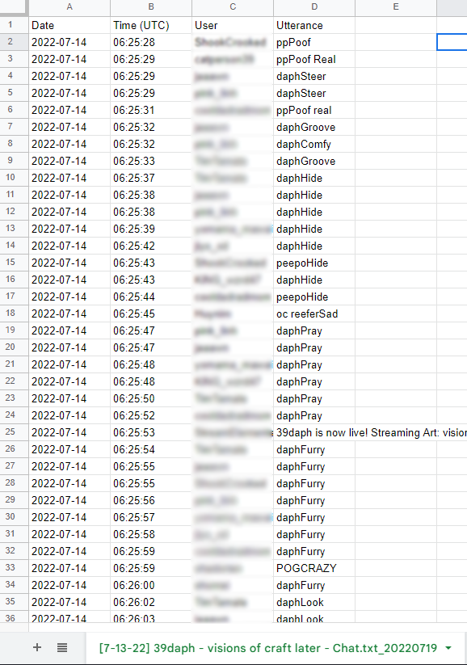

# Purpose 
Twitch Report is built for those who are looking to analyse their favourite streamers' emote usage or gifted sub count.


Twitch Text to CSV is built to organise Twitch Chat data into a format that can be more easily parsed and saved. 




## Twitch Report Creation
See option 1 "https://www.datasourse.com/check-or-download-twitch-chat-log-history/" to find out how to download Twitch channels' chat logs. 

The "example_" folders contain files that illustrate what your files should look like or what files are generated. 


# Transform TXT to CSV using ```txt2csv.py```
 **Run through command prompt/terminal**   
  
The ```txt2csv.py``` script converts Twitch chat ```.txt``` files into ```.csv``` format, organizing chat data into structured columns.
  
## Prerequisites

### Install the following libraries using pip:

```pip install pandas```

## Command Syntax
### Windows
``` python txt2csv.py <Input Folder> <Generated Folder Name> --savepath <Save Path> ```
### Mac/Linux
```python3 txt2csv.py <Input Folder> <Generated Folder Name> --savepath <Save Path>``` 

--- 

### Arguments
1. ```<Input Folder>```: Path to the folder containing ```.txt```  files.
2. ```<Generated Folder Name>```: Name for the folder where ```.csv``` files will be saved.
3. ```--savepath <Save Path>```: Directory to save the output folder.

--- 

### Output 
- A folder named ```<Generated Folder Name>CSV``` is created in the specified save path.
- Each .txt file is converted into a .csv file with columns:
    - Date
    - Time (UTC)
    - User
    - Utterance

--- 

# Generating the Config using: ```setupConfig.py```  
**Run through command prompt/terminal**   
  
The ```setupConfig.py``` script generates a ```config.yaml``` file containing a list of streamers and their emotes.
  
## Command Syntax
### Windows
``` python setupConfig.py <Input Text File> --savepath <Save Path> ```
### Mac/Linux
```python3 setupConfig.py <Input Text File> --savepath <Save Path>``` 

--- 

## Arguments
1. ```<Input Text File>```: Path to a text file containing streamer names and emotes.
2. ```--savepath <Save Path>```: Directory to save the generated ```config.yaml```.

--- 

## Output
- A ```config.yaml``` file is created in the specified save path, containing streamer names and their emotes in YAML format.

---

# Generating the Report using: ```twitchReport.py```
The twitchReport.py script processes Twitch chat CSV files to generate an analysis report in Excel format. Below are the steps and requirements to run the script.

**Run through command prompt/terminal**   

## Prerequisites

### Install the following libraries using pip:

```pip install pandas openpyxl pyyaml```

### Input Files:

- Twitch chat CSV files stored in a folder.
- A YAML configuration file containing emote data for the streamer.
- Use the Excel template file with predefined sheet names (Summary, Emote Totals, Sample).

## Command Syntax
### Windows
``` python twitchReport.py <Streamer Title> <Input Folder> <Generated File Name> <Config Path> <Excel Template Path> --savepath <Save Path> ```
### Mac/Linux
```python3 twitchReport.py <Streamer Title> <Input Folder> <Generated File Name> <Config Path> <Excel Template Path> --savepath <Save Path>``` 

--- 

### Arguments

1. ```<Streamer Title>```: The name of the streamer whose emotes are being analyzed. This must match the key in the YAML configuration file.
2. ```<Input Folder>```: Path to the folder containing Twitch chat CSV files.
3. ```<Generated File Name>```: The base name for the output Excel file (e.g., TwitchReport).
4. ```<Config Path>```: Path to the YAML configuration file containing emote data.
5. ```<Excel Template Path>```: Path to the Excel template file.
6. ```--savepath <Save Path>```: (Optional) Directory where the output Excel file will be saved.

---

### Output
1. The script generates an Excel file with the following sheets: 
    - **Summary**: Overview of emote usage, user activity, and gifted subs.
    - **Emote Totals**: Total counts of each emote.
    - **Sample**: A random sample of chat data.
2. The output file is saved in the specified ```--savepath``` directory with the format:
```<Generated File Name>_<YYYYMMDD>.xlsx```

--- 

### Notes
- Ensure the YAML configuration file contains the correct emote data for the specified streamer.
- The Excel template must have the required sheet names (Summary, Emote Totals, Sample).
- If ```--savepath``` is not provided, the script will save the output in the current working directory.

---

### Troubleshooting
- **Missing Libraries**: Install missing libraries using pip install <library_name>.
- **File Not Found Errors**: Verify the paths to the input folder, configuration file, and Excel template.
- **Invalid YAML Format**: Ensure the YAML file is properly formatted and contains the required emote data.

For further assistance, review the script's printed error messages or consult the source code.